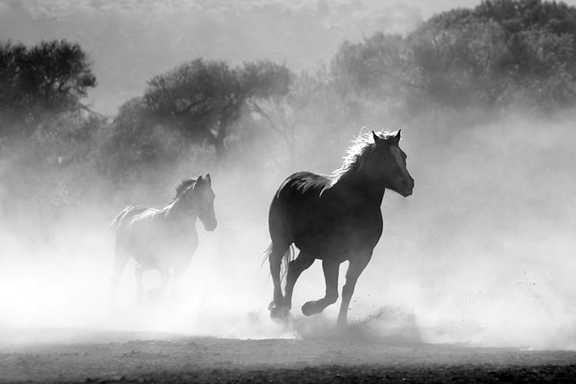

# Genetic Drawing
This is a project for imitating a painitng process given a target image (inspired by many examples of genetic drawing on the internet). It also supports user-created sampling masks, in case you'd like to specify regions where more brushstrokes are needed (for ex, to allocate more finer details).

Examples of generated images:

 

 

## Python
you would need the following python 3 libraries:

* opencv 3.4.1
* numpy 1.16.2
* matplotlib 3.0.3
* Jupyter Notebook

To start, open the GeneticDrawing.ipynb and run the example code
